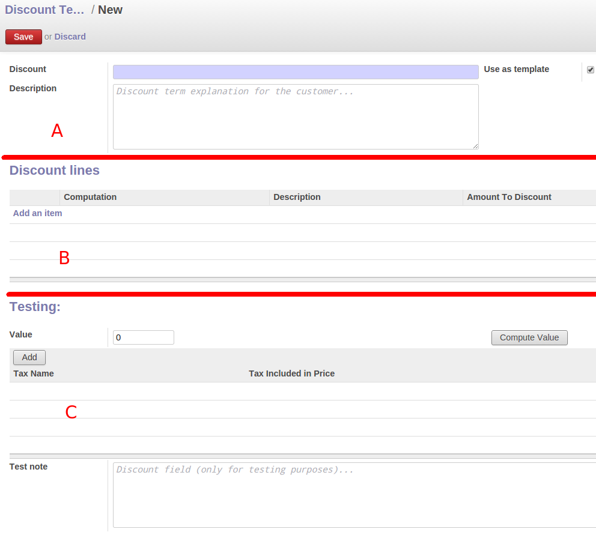

=======================
Understanding Discounts
=======================

Each invoice line may have different discount lines. 
These discount lines came from:
   * A template (see ``Invoicing // Discount // Discount Terms``.).
   * They are crated from scratch.

In the following picture we will see the discount templates menu:

Each template will contain different ``discount terms`` where the information about this template is set. 

Fields in a template
=========================

   * Field ``Discount`` short name of the term.
   * Field ``Description`` short description of the template.

Discount terms
==================================
   * Each template may contain several ``discount terms``.
   * The sequence order is important. 
   * The order allow us to specify which discount payment is calculated before. 
   *  There are three types of discount lines
         * Fixed Amount.
               * ``Description``: Required field. Text to show in the invoice when this discount is applied.
               * ``Amount to discount``. Total Amount to discount. 
               * ``Account account``: [Optional]. If this flag is set then we will generate only one ``account invoice line`` with the selected ``amount to discount``. Otherwise we will take this information from the original account invoice lines.
	       * ``Taxes``: If the ``Account account`` flag is set, then if we want to associate some taxes with this discount line we can fill this information.
         * Percentage.
               * ``Description``: Required field. Text to show in the invoice when this discount is applied.
               * ``Amount to discount``. Total Percentage to discount. Value betweeen 0, 100.  
               *  The taxes are taken from each line.
         * Subtotal.
               * Calculates again the ``base amount`` for computing the discount.
               
 
Section C => Testing fields.
============================

   We simulate to have a customer invoice line, and want to see the result of aplying this .
   
   * ``Value``: Amount of the line.    

